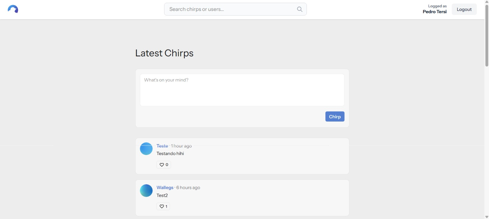
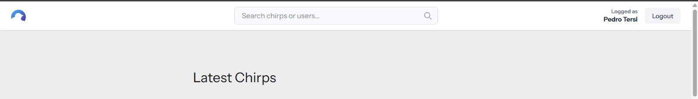
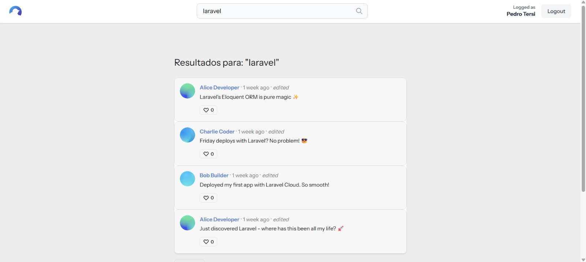

# 🐦 Chirper - Laravel Social Media

O **Chirper** é uma plataforma de rede social minimalista desenvolvida para demonstrar o poder e a elegância do framework **Laravel**. O projeto permite que usuários compartilhem pensamentos rápidos (Chirps), interajam com outros membros e gerenciem seus perfis em um ambiente moderno e responsivo.

---

## 🚀 Novas Funcionalidades (Destaques)

Diferente da versão básica do tutorial oficial, implementamos melhorias significativas no layout e na experiência do usuário:

- **🔍 Sistema de Busca Inteligente**: Adicionamos uma barra de busca integrada à navegação que permite encontrar outros usuários e publicações de forma instantânea.
- **🎨 Layout Customizado com DaisyUI**: Refatoramos toda a interface utilizando o plugin DaisyUI do Tailwind CSS, garantindo um visual moderno, componentes consistentes e suporte a temas.
- **📱 Interface Responsiva Refatorada**: Corrigimos bugs de layout e garantimos que a barra de busca e os elementos de navegação se adaptem perfeitamente a diferentes tamanhos de tela.
- **⚡ Experiência de Usuário Aprimorada**: Melhoramos o contraste visual e o feedback de interações para o usuário.

---

## 📸 Screenshots

Aqui você pode ver o resultado final do projeto:

### Página Inicial e Feed

### Sistema de Busca e Navegação

---

## 🛠️ Tecnologias Utilizadas

- **Framework:** [Laravel 11](https://laravel.com)
- **Frontend:** [Tailwind CSS](https://tailwindcss.com) & [DaisyUI](https://daisyui.com)
- **Banco de Dados:** SQLite (ou MySQL)
- **Autenticação:** Sistema nativo de autenticação do Laravel

